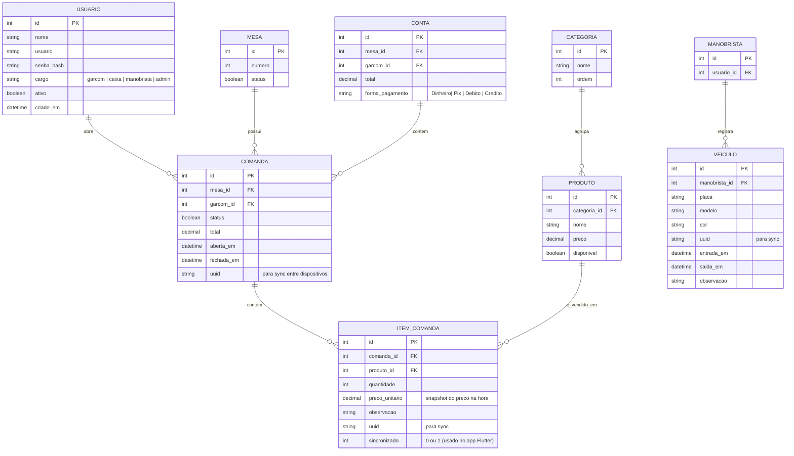

```mermaid

erDiagram
    USUARIO ||--o{ COMANDA : "abre"
    USUARIO {
        int id PK
        string nome
        string usuario
        string senha_hash
        string cargo "garcom | caixa | manobrista | admin"
        boolean ativo
        datetime criado_em
    }

    MESA ||--o{ COMANDA : "possui"
    MESA {
        int id PK
        int numero
        boolean status
    }

    COMANDA ||--o{ ITEM_COMANDA : "contem"
    COMANDA {
        int id PK
        int mesa_id FK
        int garcom_id FK
        boolean status
        decimal total
        datetime aberta_em
        datetime fechada_em
        string uuid "para sync entre dispositivos"
    }

    CONTA ||--o{ COMANDA : "contem"
    CONTA {
        int id PK
        int mesa_id FK
        int garcom_id FK
        decimal total
        string forma_pagamento "Dinheiro| Pix | Debito | Credito"
    }

    CATEGORIA ||--o{ PRODUTO : "agrupa"
    CATEGORIA {
        int id PK
        string nome
        int ordem
    }

    PRODUTO ||--o{ ITEM_COMANDA : "e_vendido_em"
    PRODUTO {
        int id PK
        int categoria_id FK
        string nome
        decimal preco
        boolean disponivel
    }

    ITEM_COMANDA {
        int id PK
        int comanda_id FK
        int produto_id FK
        int quantidade
        decimal preco_unitario "snapshot do preco na hora"
        string observacao
        string uuid "para sync"
        int sincronizado "0 ou 1 (usado no app Flutter)"
    }

    MANOBRISTA ||--o{ VEICULO : "registra"
    MANOBRISTA {
        int id PK
        int usuario_id FK
    }

    VEICULO {
        int id PK
        int manobrista_id FK
        string placa
        string modelo
        string cor
        string uuid "para sync"
        datetime entrada_em
        datetime saida_em
        string observacao
    }

```