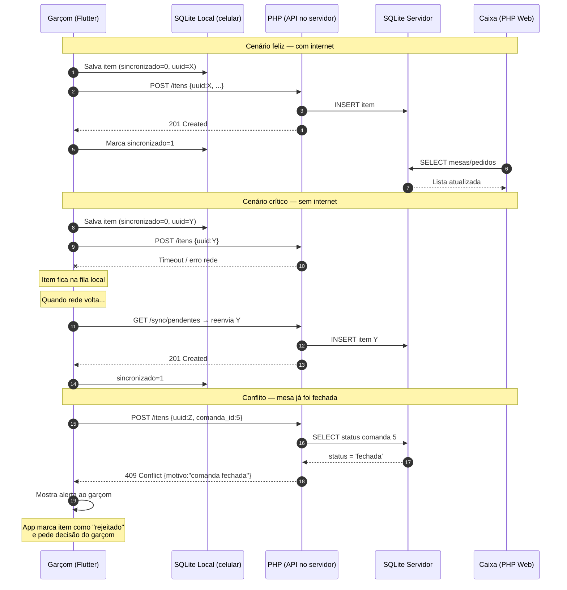

```mermaid

sequenceDiagram
    autonumber
    participant G as Garçom (Flutter)
    participant DB_Local as SQLite Local (celular)
    participant API as PHP (API no servidor)
    participant DB_Serv as SQLite Servidor
    participant C as Caixa (PHP Web)

    Note over G,C: Cenário feliz — com internet
    G->>DB_Local: Salva item (sincronizado=0, uuid=X)
    G->>API: POST /itens {uuid:X, ...}
    API->>DB_Serv: INSERT item
    API-->>G: 201 Created
    G->>DB_Local: Marca sincronizado=1
    C->>DB_Serv: SELECT mesas/pedidos
    DB_Serv-->>C: Lista atualizada

    Note over G,C: Cenário crítico — sem internet
    G->>DB_Local: Salva item (sincronizado=0, uuid=Y)
    G->>API: POST /itens {uuid:Y}
    API--xG: Timeout / erro rede
    Note over G: Item fica na fila local
    Note over G: Quando rede volta...
    G->>API: GET /sync/pendentes → reenvia Y
    API->>DB_Serv: INSERT item Y
    API-->>G: 201 Created
    G->>DB_Local: sincronizado=1

    Note over G,C: Conflito — mesa já foi fechada
    G->>API: POST /itens {uuid:Z, comanda_id:5}
    API->>DB_Serv: SELECT status comanda 5
    DB_Serv-->>API: status = 'fechada'
    API-->>G: 409 Conflict {motivo:"comanda fechada"}
    G->>G: Mostra alerta ao garçom
    Note over G: App marca item como "rejeitado"<br/>e pede decisão do garçom

```